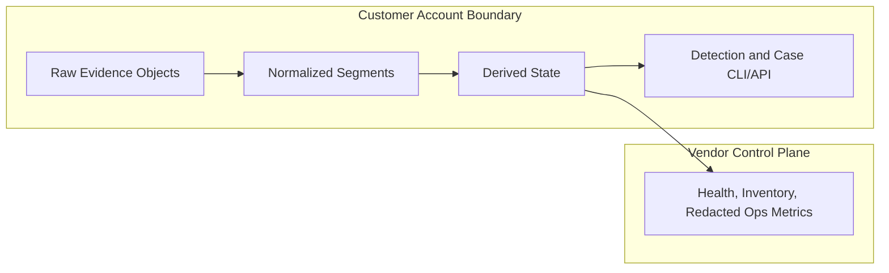

# Deployment Boundary

```mermaid
flowchart LR
    subgraph Customer["Customer Account Boundary"]
        Raw["Raw Evidence Objects"]
        Norm["Normalized Segments"]
        State["Derived State"]
        Detect["Detection and Case CLI/API"]
    end
    subgraph Vendor["Vendor Control Plane"]
        Ops["Health, Inventory, Redacted Ops Metrics"]
    end
    Raw --> Norm --> State --> Detect
    State --> Ops
```

- No raw telemetry leaves the customer account boundary.
- Only deployment health, inventory, and optional redacted operational metrics may leave.
